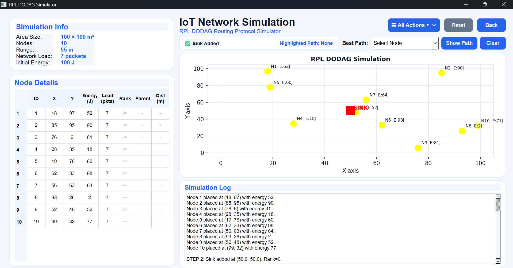
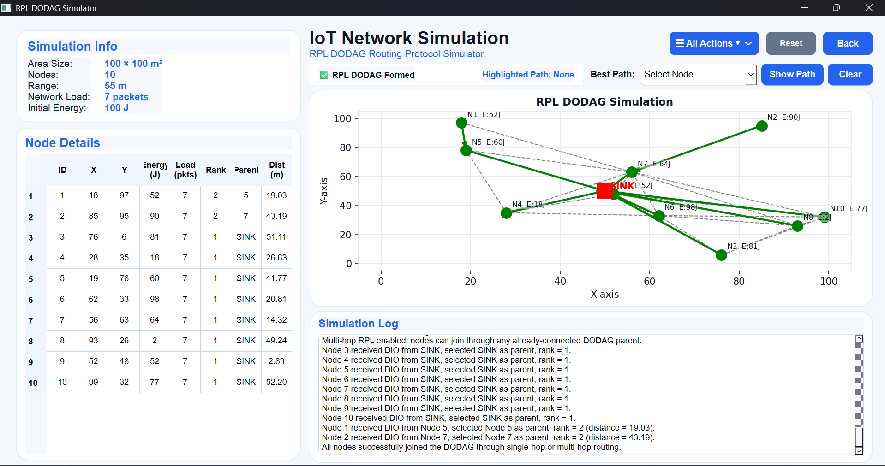
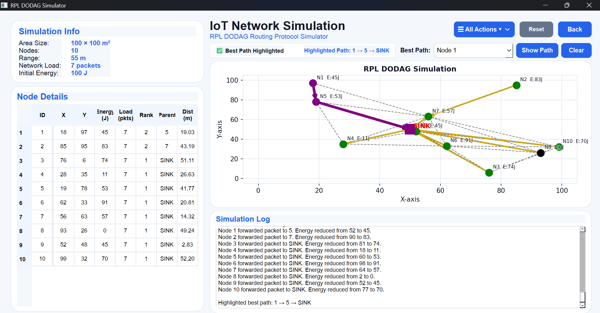
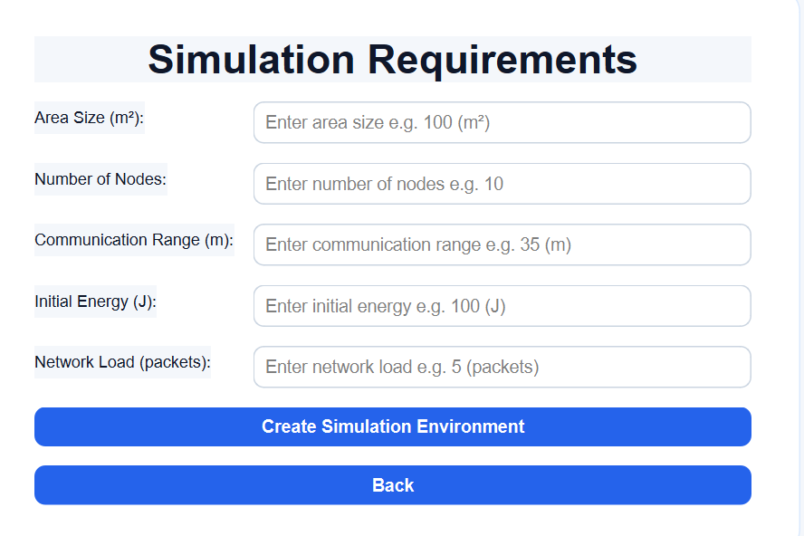

# RPL DODAG Simulator

Desktop-based simulator of the RPL routing protocol used in IoT networks.

## Features
- DODAG formation
- Multi-hop routing
- Neighbor discovery
- Packet forwarding
- Energy-aware communication

## Technologies Used
- Python
- PyQt5
- Matplotlib

## Run Project
python main.py
## Screenshots

### GUI Interface

### DODAG Formation

### Packet Forwarding

### Simulation Requirements

